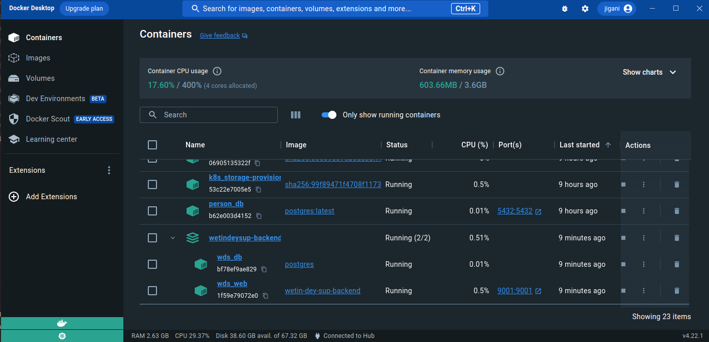
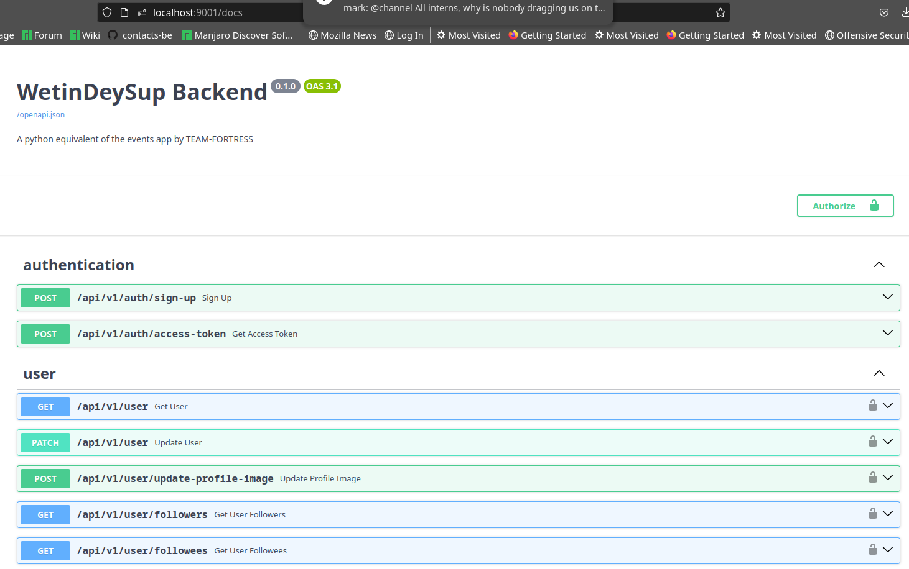

# WetinDeySup Backend

## Development Setup
The easiest way to set up this project is to use docker. please install `docker-desktop`
to continue.
- clone this repository
- cd into the project root
- copy the contents of the `env_sample` file into a newly created `.env` file in the 
    projects root directory (Tweaking the `.env` file to your needs is okay but the
    `env_sample` file is good place to start)
- Launch your `docker-desktop`
- Spin up a container for the project with `docker compose up --build -d`
- You should be able to access the project at [http://127.0.0.1:9001](http://127.0.0.1:9001)

See the `wetindeysup-backend` container with `wds_db` and `wds_web`

